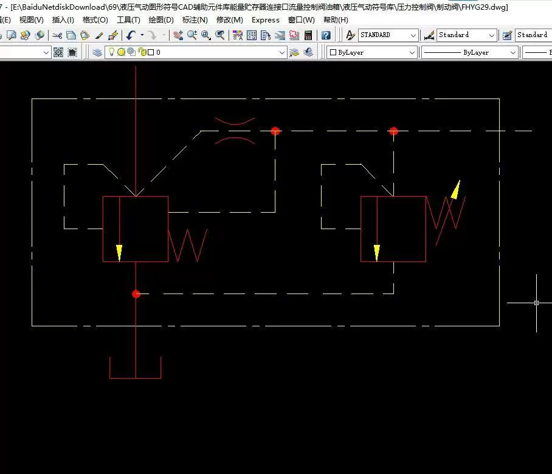
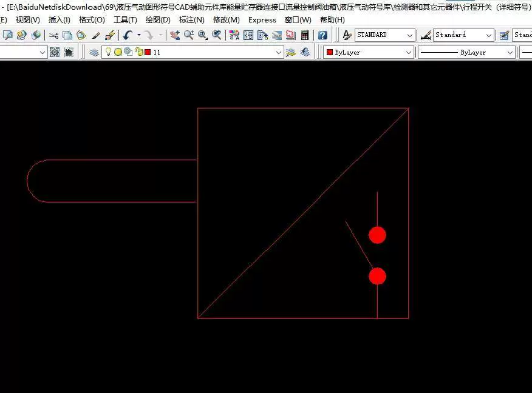
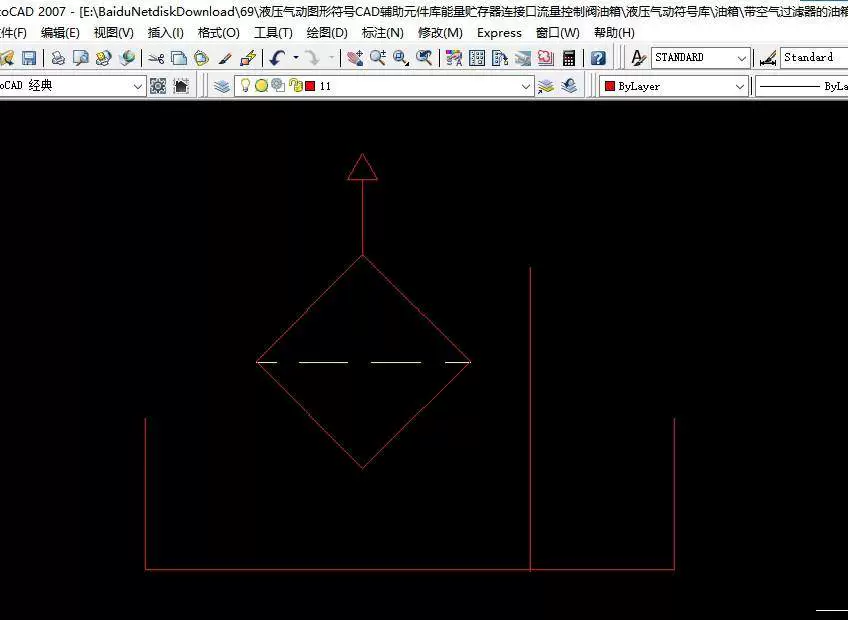

# The hydraulic and pneumatic CAD symbol library supports the entire set of components for assisting in the design of hydraulic systems.

## Body

Hydraulic and pneumatic CAD symbol library supports the entire 2007 component library for assisted design of hydraulic systems graphics 69.

Hydraulic and pneumatic CAD symbol library supports the entire 2007 component library for assisting in the design of hydraulic systems graphics.

【Professional hydraulic and pneumatic CAD symbol library】

Designed specifically for CAD2007! Includes a vast collection of high-definition, standardized hydraulic and pneumatic symbols to help you efficiently complete your design drawings.

More auxiliary components, actuating components, and control components symbols!

* **Instant-on:** CAD files can be directly used, saving time and effort.
* **Clear Classification:** Components are categorized by function, making it easy to find.
* **Compatibility Guaranteed:** Perfectly supports AutoCAD 2007 (a classic stable version).

**Applicable Audience:** Hydraulic and pneumatic engineers, mechanical designers, related professionals, equipment maintenance personnel.

Say goodbye to hand-drawn symbols and significantly boost your design efficiency and the professionalism of your drawings! A one-time purchase, long-term benefits.

#Hydraulic Symbols #CAD Library #CAD2007 #Hydraulic Design #Pneumatic Symbols #Mechanical Design #Auxiliary Elements #Flow Control Valve #Engineering Library

## Images

## Payment

Here is a pay link on Stripe ( https://buy.stripe.com/3cs8yP7sY87d0vu9AB ). Please contact me lonlonago@foxmail.com after funding $89, and I will send you a complete data files , thank you!

